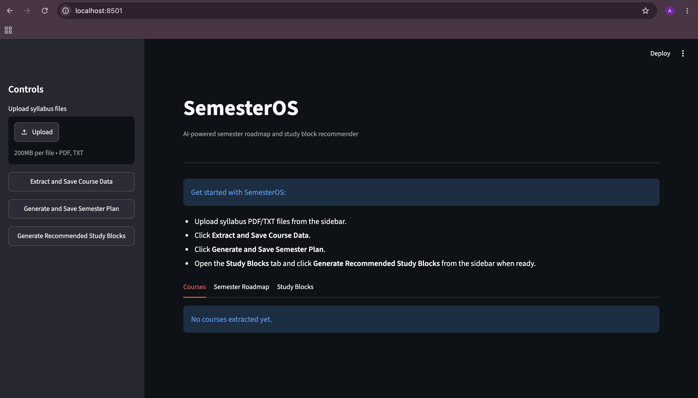
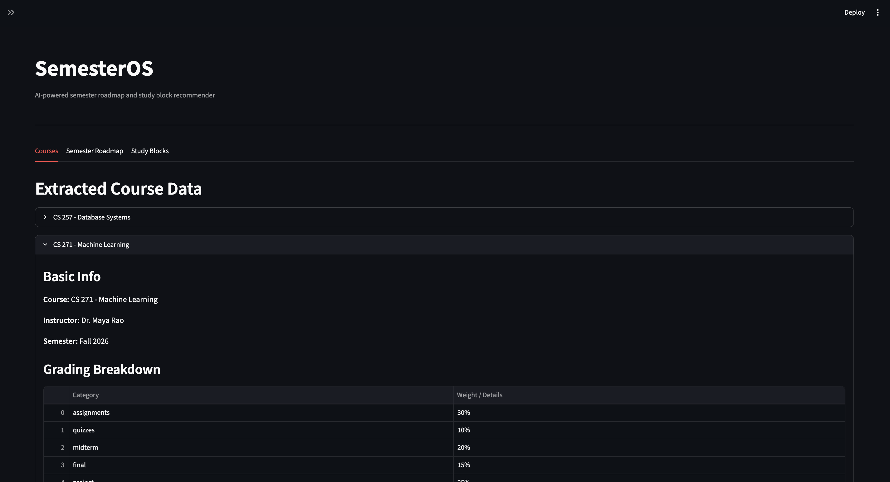
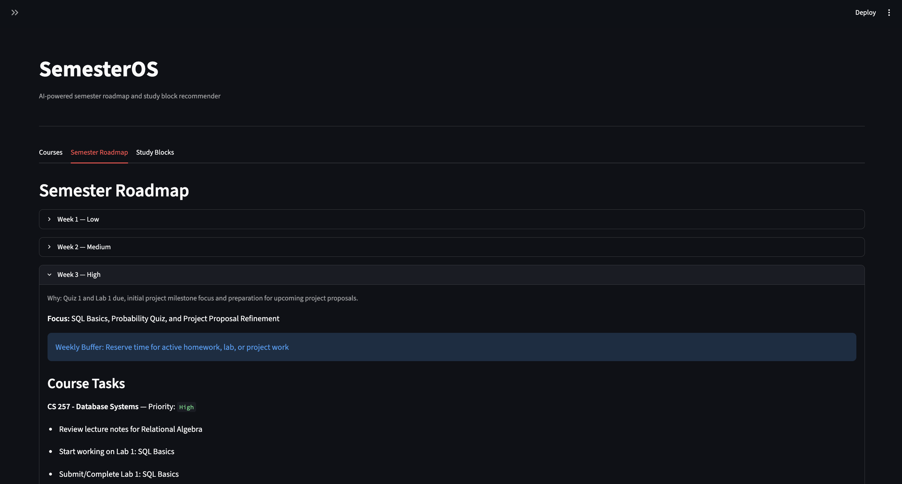
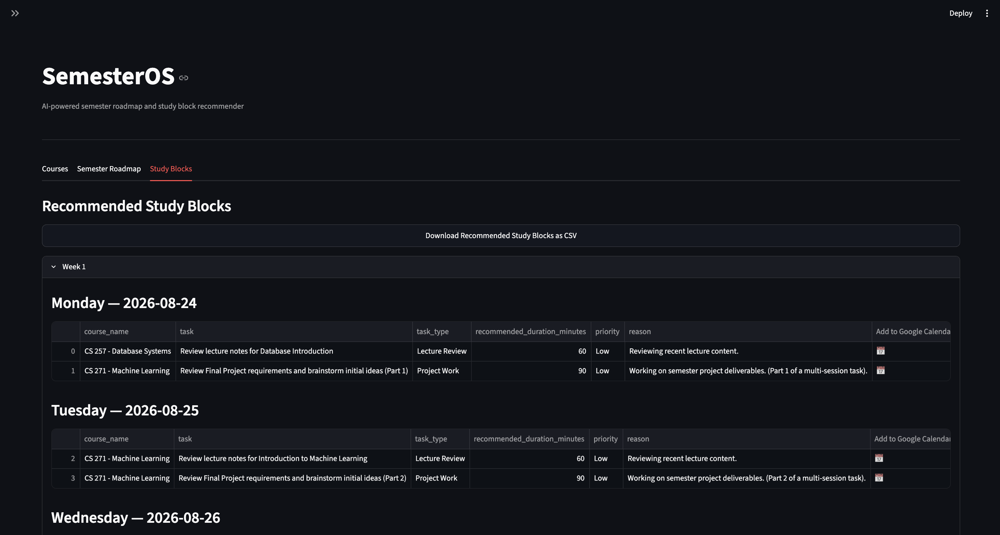

# SemesterOS

SemesterOS is an AI-powered academic planning app that converts course syllabi into a structured semester roadmap and flexible weekly study block recommendations.

It helps students quickly understand upcoming coursework, identify heavy workload weeks, plan study time, download study blocks as CSV, and open study blocks in Google Calendar.

---

## Features

* User uploads course syllabi as PDF or TXT files
* Extracts structured course data using Gemini
* Generates a week-wise semester roadmap
* Shows weekly focus, workload level, and one-line workload reason
* Adds weekly assignment buffers automatically
* Generates recommended study blocks based on:

  * semester start date
  * lecture days
  * preferred study days
  * session length preference
  * weekend preference
* Recommends flexible study blocks with day, date, and duration
* Download study blocks option as CSV
* Opens each study block in Google Calendar
* Saves generated outputs as JSON files inside the `docs/` folder

---


## Project Motivation

Students often receive multiple syllabi at the beginning of a semester. Each syllabus may include assignments, labs, exams, projects, weekly topics, and grading details in different formats.

Manually combining all of that information into a semester-wide plan can be time-consuming. SemesterOS helps by turning syllabus content into a centralized roadmap and study plan.

The app does not automatically choose exact calendar times. Instead, it recommends what to study, on which day, for how long. Students can then choose the exact time that works best for them.

---

## Tech Stack

* Python
* Streamlit
* Gemini API
* pandas
* pypdf
* Google Calendar template links
* JSON caching

---

## Project Structure

```text
SemesterOS/
├── app.py
├── parser/
│   └── assessment_extractor_agent.py
├── planner/
│   ├── semester_planning_agent.py
│   └── task_scheduler_agent.py
├── integrations/
│   └── google_calendar_link.py
├── utils/
│   └── cache_manager.py
├── docs/
│   ├── extracted_courses_cache.json
│   ├── semester_plan_cache.json
│   └── recommended_study_blocks_cache.json
├── assets/
│   └── screenshots/
│       ├── home.png
│       ├── course-data.png
│       ├── semester-roadmap.png
│       └── study-blocks.png
├── requirements.txt
├── .gitignore
└── README.md
```

---

## How It Works

### 1. Upload Syllabi

Users upload syllabus files from the sidebar.

Supported formats:

* PDF
* TXT

### 2. Extract Course Data

SemesterOS reads the syllabus text and sends it to Gemini. The app extracts structured course information such as:

* course name
* instructor
* semester
* grading breakdown
* major assessments
* project information
* weekly topics
* missing information

### 3. Generate Semester Roadmap

The extracted course data is passed to the semester planning agent. The app generates a 15-week roadmap with:

* weekly focus
* workload level
* one-line workload reason
* course-specific tasks

The roadmap avoids inventing due dates, exams, assignments, labs, or projects that are not present in the syllabus data.

### 4. Add Weekly Assignment Buffers

After the roadmap is generated, SemesterOS adds one weekly assignment buffer to each week:

```text
Assignment Buffer: Reserve time for active homework, lab, or project work
```

This keeps buffers consistent and prevents repeated generic tasks from being generated by the AI.

### 5. Generate Recommended Study Blocks

The study block recommender converts the semester roadmap into flexible study block recommendations.

Each study block includes:

* week
* day
* date
* course name
* task
* task type
* recommended duration
* priority
* reason

Study blocks do not include exact start or end times.

### 6. Open Blocks in Google Calendar

Each study block includes a Google Calendar icon. When clicked, it opens a draft Google Calendar event with the task details.

The user can then choose the exact time inside Google Calendar.

---

## Setup Instructions

### 1. Clone the Repository

```bash
git clone <your-repository-url>
cd SemesterOS
```

### 2. Create a Virtual Environment

```bash
python -m venv venv
```

Activate it:

```bash
source venv/bin/activate
```

On Windows:

```bash
venv\Scripts\activate
```

### 3. Install Dependencies

```bash
pip install -r requirements.txt
```

### 4. Add Environment Variables

Create a `.env` file in the project root:

```text
GEMINI_API_KEY=your_gemini_api_key_here
```

### 5. Run the App

```bash
streamlit run app.py
```

---

## Usage Flow

1. Upload syllabus PDF/TXT files from the sidebar.
2. Click **Extract and Save Course Data**.
3. Click **Generate and Save Semester Plan**.
4. Review the roadmap in the **Semester Roadmap** tab.
5. Click **Generate Recommended Study Blocks** from the sidebar.
6. Fill study preferences in the **Study Blocks** tab.
7. Click **Create Study Blocks**.
8. Review recommended study blocks.
9. Download the CSV or click the calendar icon to open a block in Google Calendar.

---

## Generated Files

SemesterOS saves generated outputs inside the `docs/` folder:

```text
docs/extracted_courses_cache.json
docs/semester_plan_cache.json
docs/recommended_study_blocks_cache.json
```

These files are generated automatically when the user extracts course data, generates a roadmap, or creates study blocks.


Note: The `docs/` folder contains sample input files and generated JSON outputs.

---

## Google Calendar Integration

SemesterOS does not directly create calendar events using the Google Calendar API.

Instead, it creates Google Calendar template links. Each study block has a calendar icon that opens a draft event in Google Calendar.

This allows the user to confirm the event and choose the exact time manually.

---

## Current MVP Scope

The current MVP includes:

* syllabus upload
* course data extraction
* semester roadmap generation
* weekly assignment buffers
* recommended study blocks
* CSV export
* Google Calendar draft links

---

## Future Improvements

Possible future improvements include:

* Google Calendar API integration
* user authentication
* saved user preferences
* calendar conflict detection
* Canvas or LMS integration
* OCR support for scanned PDFs
* drag-and-drop study block editing
* workload analytics dashboard

---

## Demo Script

A simple demo flow:

1. Open SemesterOS.
2. Upload syllabus files.
3. Extract course data.
4. Show extracted course information.
5. Generate the semester roadmap.
6. Explain weekly workload levels and assignment buffers.
7. Open the Study Blocks tab.
8. Enter study preferences.
9. Generate recommended study blocks.
10. Download the CSV.
11. Click the calendar icon to open a Google Calendar draft event.

---

## Screenshots

### Home / Course Upload



### Extracted Course Data



### Semester Roadmap




### Recommended Study Blocks




---

## Notes

SemesterOS is a planning assistant. Students should still verify official deadlines and announcements from instructors, Canvas, or the official syllabus.
